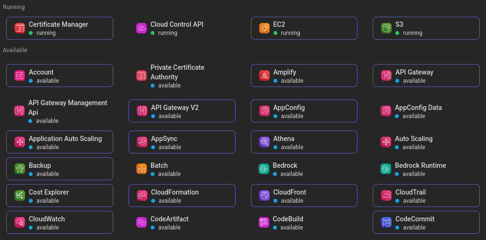

# Python Network Automation – LocalStack + GCP



This project is a **Python-based network provisioning and validation framework** that automates the creation of **VPCs, subnets, and routing tables** across **LocalStack (AWS-like)** and **Google Cloud Platform (GCP)**.
It ensures **cross-cloud consistency**, **real-time validation**, and **infrastructure state synchronization** using:

* **Boto3** (LocalStack/AWS)
* **Google Cloud SDK (Python API)**
* **Paramiko** (SSH validation)

---

## **Features**

### **Network Provisioning**

* Create VPCs and subnets
* Create and associate route tables
* Automatically sync topology across LocalStack & GCP
* Idempotent: re-running does not duplicate resources

### **Validation**

* Connect to remote hosts via SSH
* Run commands (e.g., `ip route`, `ip addr`)
* Verify routing and network consistency

### **Environment Support**

* LocalStack (local AWS emulator)
* GCP (real cloud)

---

## **Project Structure**

```
cloud-network-automation/
├── providers/
│   ├── localstack_provider.py
│   └── gcp_provider.py
├── validators/
│   └── ssh_validator.py
├── utils/
│   └── logger.py
├── config.yaml
├── main.py
├── requirements.txt
└── README.md
```

---

## **1. Prerequisites**

### **Python**

```
Python 3.9+
virtualenv recommended
```

### **LocalStack**

You can run LocalStack via Docker:

```bash
docker run --rm -it -p 4566:4566 -p 4571:4571 localstack/localstack:latest
```

### **GCP Credentials**

Create a service account with the following permissions:

* Compute Network Admin
* Compute Admin
* Service Account Token Creator (optional for local auth)

Then:

```bash
export GOOGLE_APPLICATION_CREDENTIALS="/path/to/service-account.json"
```

### **SSH**

To run validation:

* Ensure your SSH private key exists (`~/.ssh/id_rsa`)
* Add your SSH-accessible host IP in `config.yaml`

---

## **2. Installation**

```bash
git clone https://github.com/your-username/python-network-automation.git
cd python-network-automation

python3 -m venv .venv
source .venv/bin/activate

pip install -r requirements.txt
```

---

## **3. Configuration**

Edit the file:

```
config.yaml
```

Example:

```yaml
localstack:
  endpoint_url: http://localhost:4566
  region: us-east-1
  vpc:
    cidr_block: 10.0.0.0/16
    name: local-vpc-demo
```

See full sample config in the repo.

---

## **4. Usage**

### **Provision in LocalStack**

```bash
python main.py --config config.yaml --env localstack --action provision
```

### **Provision in GCP**

```bash
python main.py --config config.yaml --env gcp --action provision
```

### **Provision in both**

```bash
python main.py --config config.yaml --env both --action provision
```

### **Run SSH validation**

```bash
python main.py --config config.yaml --action validate
```

### **Run everything**

```bash
python main.py --config config.yaml --action all
```

---

## **5. Verifying LocalStack Resources**

```bash
aws ec2 describe-vpcs --endpoint-url http://localhost:4566 --region us-east-1
aws ec2 describe-subnets --endpoint-url http://localhost:4566 --region us-east-1
aws ec2 describe-route-tables --endpoint-url http://localhost:4566 --region us-east-1
```

---

## **6. Logs**

The project uses a lightweight Python logger (`utils/logger.py`).
Logs print to the console with:

* timestamp
* log level
* module name

Example:

```
2025-11-13 22:29:44 [INFO] localstack-provider: Created subnet subnet-12345 (10.0.1.0/24)
```

---

## **7. Troubleshooting**

### **LocalStack errors**

* Ensure LocalStack is running at `http://localhost:4566`
* If resources fail to create, run:

  ```bash
  localstack logs
  ```

### **GCP permission errors**

Make sure your service account has:

```
roles/compute.admin
roles/compute.networkAdmin
```

### **SSH validation fails**

* Ensure IP is reachable
* Ensure user and key are correct
* Check firewall rules (GCP may block SSH)

### **Paramiko TripleDES warnings**

These are safe to ignore.

---

## **8. Future Enhancements**

* Drift detection (compare LS <-> GCP resources)
* Automatic instance creation for deeper validation
* Web dashboard visualizing infrastructure
* Export topology to Terraform or Pulumi
* Adding AWS real-cloud support

---

## **License**

MIT License.
Feel free to use, modify, and contribute.
